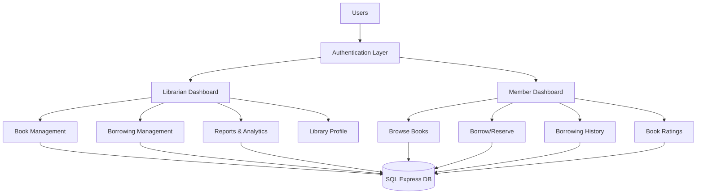

# Library Management System Implementation Plan

## Architecture Overview



## Database Design

### Entity Relationship Structure

**Core Entities:**

1. **User** (Base entity for authentication)
   - UserId (PK)
   - Email, Password (hashed), Role (Librarian/Member)
   - FirstName, LastName, PhoneNumber
   - RegistrationDate, IsActive

2. **LibraryProfile** (One-to-One with User - Librarian only)
   - LibraryId (PK)
   - LibraryName, Location, OperatingHours
   - ContactEmail, ContactPhone
   - CreatedByUserId (FK to User)

3. **Book**
   - BookId (PK)
   - Title, Author, Genre, ISBN
   - Summary, PublicationYear
   - CoverImagePath, AvailableCopies, TotalCopies
   - DateAdded

4. **BorrowingConfiguration** (One-to-One with LibraryProfile)
   - ConfigId (PK)
   - LibraryId (FK)
   - LoanDurationDays, MaxRenewals
   - MaxBorrowableItems, OverduePenaltyPerDay

5. **BorrowingTransaction** (Many-to-Many bridge: User ↔ Book)
   - TransactionId (PK)
   - UserId (FK), BookId (FK)
   - BorrowDate, DueDate, ReturnDate
   - Status (Borrowed/Reserved/Returned/Overdue)
   - RenewalCount, FineAmount, FinePaid

6. **BookRating** (Many-to-Many: User ↔ Book)
   - RatingId (PK)
   - UserId (FK), BookId (FK)
   - Rating (1-5), ReviewText
   - DateSubmitted

**Relationships:**

- User 1:N BorrowingTransaction (One member, many borrows)
- Book 1:N BorrowingTransaction (One book, many borrows)
- User 1:N BookRating
- Book 1:N BookRating
- LibraryProfile 1:1 BorrowingConfiguration

## Project Structure

```
LibraryManagementSystem/
├── Controllers/
│   ├── AccountController.cs        # Login, Registration
│   ├── HomeController.cs           # Landing page, group details
│   ├── LibrarianController.cs      # Admin dashboard & operations
│   ├── BookController.cs           # Book CRUD (Admin)
│   ├── MemberController.cs         # Member dashboard
│   ├── BorrowingController.cs      # Borrow/Return operations
│   └── ReportController.cs         # Analytics & reports
├── Models/
│   ├── User.cs
│   ├── Book.cs
│   ├── BorrowingTransaction.cs
│   ├── BookRating.cs
│   ├── LibraryProfile.cs
│   ├── BorrowingConfiguration.cs
│   └── ViewModels/
│       ├── LoginViewModel.cs
│       ├── RegisterViewModel.cs
│       ├── BookDetailsViewModel.cs
│       ├── BorrowingDashboardViewModel.cs
│       └── ReportViewModel.cs
├── Views/
│   ├── Shared/
│   │   ├── _Layout.cshtml          # Main navigation menu
│   │   └── _LoginPartial.cshtml
│   ├── Home/
│   │   └── Index.cshtml            # Group details table
│   ├── Account/
│   ├── Librarian/
│   ├── Member/
│   ├── Book/
│   └── Borrowing/
├── Data/
│   └── LibraryDbContext.cs         # EF Core DbContext
├── wwwroot/
│   ├── css/
│   │   └── custom-styles.css       # Custom CSS design
│   ├── images/
│   │   └── book-covers/
│   └── js/
└── Migrations/                      # EF Core migrations
```

## Implementation Phases

### Phase 1: Project Setup & Database Foundation

**1.1 Create ASP.NET MVC Project**

- Use Visual Studio to create new ASP.NET Core MVC project
- Target .NET 6.0 or higher
- Configure SQL Express connection string in `appsettings.json`

**1.2 Install Required NuGet Packages**

- `Microsoft.EntityFrameworkCore.SqlServer`
- `Microsoft.EntityFrameworkCore.Tools`
- `Microsoft.AspNetCore.Identity.EntityFrameworkCore`
- `BCrypt.Net-Next` (password hashing)

**1.3 Create Entity Models**

- Define all 6 entity classes with data annotations:
  - `[Required]`, `[StringLength]`, `[EmailAddress]`
  - `[Range]` for numerical constraints
  - `[DataType]` for dates, passwords
  - `[Display(Name = "...")]` for friendly labels
  - `[RegularExpression]` for ISBN format validation

**1.4 Configure DbContext**

- Create `LibraryDbContext` inheriting from `DbContext`
- Configure entity relationships using Fluent API in `OnModelCreating`
- Set up cascade delete rules appropriately

**1.5 Generate Database**

- Create initial migration: `Add-Migration InitialCreate`
- Update database: `Update-Database`
- Verify tables created in SQL Server Management Studio

### Phase 2: Authentication & Authorization

**2.1 User Registration**

- Create `RegisterViewModel` with validation attributes
- Implement `AccountController.Register()` GET/POST actions
- Hash passwords using BCrypt before saving
- Default role assignment during registration

**2.2 User Login**

- Create `LoginViewModel`
- Implement `AccountController.Login()` with session management
- Use ASP.NET Core Identity or custom cookie authentication
- Store user role in claims/session

**2.3 Role-Based Authorization**

- Create custom `[AuthorizeRole("Librarian")]` attribute
- Protect controller actions based on roles
- Implement logout functionality

**2.4 Navigation Menu**

- Create `_Layout.cshtml` with conditional menu items:
  - Guest: Home, Login, Register
  - Librarian: Dashboard, Books, Borrowing, Reports, Profile
  - Member: Browse, My Borrowing, History, Profile

### Phase 3: Homepage & Group Details

**3.1 Create Home/Index View**

- Display group member details in HTML table:
  - Student ID | Full Name columns
  - Professional styling with CSS
- Add welcome section with library overview
- Show featured books (optional enhancement)

**3.2 Public Book Browse**

- Display available books on homepage
- Show book covers, titles, authors
- "Login to Borrow" call-to-action for guests

### Phase 4: Librarian Features

**4.1 Library Profile Management**

- Create CRUD views for `LibraryProfile`
- Form fields: Library Name, Location, Hours, Contact Details
- Single profile per librarian (check on create)

**4.2 Borrowing Configuration**

- Create/Edit form for `BorrowingConfiguration`
- Inputs: Loan Duration, Max Renewals, Max Items, Penalty Rate
- Link to library profile

**4.3 Book Management (CRUD)**

- **Create:** Form with file upload for book covers
  - Save uploaded images to `wwwroot/images/book-covers/`
  - Store relative path in database
- **Read:** Table view with search/filter by genre, author, availability
- **Update:** Edit book details, update availability
- **Delete:** Soft delete or prevent if book has active borrows

**4.4 Borrowing Transaction Management**

- Dashboard showing all active borrows
- Filter by status: Borrowed, Reserved, Overdue
- "Mark as Returned" action
  - Calculate fines if overdue
  - Update book availability (+1 copy)
- View member borrowing history

**4.5 Book Ratings Management**

- View all ratings submitted by members
- Option to hide/remove inappropriate reviews (optional)

### Phase 5: Member Features

**5.1 Browse Books**

- Display all available books (`AvailableCopies > 0`)
- Search by title, author, genre
- Click book for detailed view:
  - Summary, cover image, rating average
  - "Borrow" or "Reserve" button

**5.2 Borrow/Reserve Books**

- Check member's current borrow count vs. `MaxBorrowableItems`
- Create `BorrowingTransaction` record:
  - Status: "Borrowed" if copies available, else "Reserved"
  - Set `DueDate` = `BorrowDate + LoanDurationDays`
  - Decrement `AvailableCopies` if borrowed
- Show success message with due date

**5.3 My Borrowing Dashboard**

- Show active borrows with status badges:
  - Borrowed (green), Overdue (red), Reserved (yellow)
- "Renew" button if `RenewalCount < MaxRenewals`
- Calculate and display fines for overdue books

**5.4 Borrowing History**

- Table of all past transactions
- Columns: Book Title, Borrow Date, Return Date, Fine Paid
- Filter by date range

**5.5 Book Ratings/Feedback**

- "Rate & Review" button on borrowed books
- Star rating (1-5) + text review
- Show member's own ratings in history

### Phase 6: Reporting System

**6.1 Librarian Reports**

- **Borrowing Trends:** Chart showing borrows per month
- **Overdue Books:** List with member details and fine amounts
- **Most Active Members:** Top 10 by borrow count
- **Most Popular Books:** Top 10 by borrow count
- Use LINQ queries aggregating transaction data

**6.2 Report Export (Optional)**

- Generate PDF or CSV downloads using libraries like:
  - `iTextSharp` (PDF)
  - `CsvHelper` (CSV)

### Phase 7: UI/UX Design

**7.1 Custom CSS Styling**
Create `wwwroot/css/custom-styles.css` with:

- **Color Scheme:** Professional library theme (e.g., navy blue, cream, gold accents)
- **Typography:** Readable fonts (e.g., Roboto, Open Sans)
- **Components:**
  - Styled navigation bar with hover effects
  - Card-based book displays with shadows
  - Status badges (borrowed, overdue, available)
  - Form styling with consistent input fields
  - Responsive tables
  - Modal dialogs for confirmations

**7.2 Responsive Design**

- Use CSS Grid/Flexbox for layouts
- Mobile-friendly navigation (hamburger menu)
- Ensure forms work on tablets/phones

**7.3 Book Cover Images**

- Default placeholder image if cover not uploaded
- Consistent image dimensions (e.g., 300x450px)
- Hover effects (scale, shadow)

### Phase 8: Validation & Error Handling

**8.1 Server-Side Validation**

- Model validation using data annotations
- Custom validation attributes:
  - `[FutureDate]` for due dates
  - `[UniqueISBN]` for book creation
- Return validation errors to views with `ModelState`

**8.2 Client-Side Validation**

- Enable jQuery validation in `_Layout.cshtml`
- Add validation scripts: `jquery.validate.min.js`
- Real-time feedback on forms

**8.3 Error Messages**

- Custom error messages in data annotations:
  ```csharp
  [Required(ErrorMessage = "Book title is required")]
  [StringLength(200, ErrorMessage = "Title cannot exceed 200 characters")]
  ```
- Display validation summary in views

**8.4 Global Error Handling**

- Custom error pages (404, 500)
- Try-catch blocks in controller actions
- Log errors to file or database

### Phase 9: Business Logic & Constraints

**9.1 Borrowing Rules Enforcement**

- Check availability before borrowing
- Prevent borrowing if member has overdue items with unpaid fines
- Block borrowing if at `MaxBorrowableItems` limit
- Auto-update status to "Overdue" (background job or on-page-load check)

**9.2 Fine Calculation**

- Formula: `(CurrentDate - DueDate).Days * OverduePenaltyPerDay`
- Display fine amount in borrowing dashboard
- "Pay Fine" feature (mark `FinePaid = true`)

**9.3 Renewal Logic**

- Only allow renewal if not overdue
- Extend `DueDate` by `LoanDurationDays`
- Increment `RenewalCount`

### Phase 10: Testing & Finalization

**10.1 Seed Test Data**

- Create database seeding in `DbContext`:
  - Sample librarian and member accounts
  - 20-30 books across various genres
  - Sample borrowing transactions
  - Sample ratings

**10.2 Integration Testing**

- Test complete user flows:
  - Registration → Login → Browse → Borrow → Return
  - Librarian: Add Book → Member Borrows → Librarian Marks Returned
- Test edge cases (overdue, max borrow limit, renewals)

**10.3 Deployment Preparation**

- Ensure connection string works without modification
- Include SQL Express setup instructions in README
- Bundle all migrations in project
- Test on clean machine (VM or teammate's computer)

**10.4 Documentation**

- README with:
  - Group member details
  - Setup instructions (restore packages, update database)
  - Admin login credentials for testing
  - Features checklist
- Comment complex business logic in code

## Key Technical Decisions

### Data Annotations Example

```csharp
public class Book
{
    [Key]
    public int BookId { get; set; }

    [Required(ErrorMessage = "Title is required")]
    [StringLength(200, ErrorMessage = "Title too long")]
    [Display(Name = "Book Title")]
    public string Title { get; set; }

    [Required]
    [StringLength(100)]
    public string Author { get; set; }

    [RegularExpression(@"^\d{3}-\d{10}$", ErrorMessage = "Invalid ISBN format")]
    public string ISBN { get; set; }

    [Range(0, int.MaxValue, ErrorMessage = "Copies must be positive")]
    public int AvailableCopies { get; set; }
}
```

### Relationship Configuration (Fluent API)

```csharp
protected override void OnModelCreating(ModelBuilder modelBuilder)
{
    // One-to-Many: User → BorrowingTransaction
    modelBuilder.Entity<BorrowingTransaction>()
        .HasOne(bt => bt.User)
        .WithMany(u => u.BorrowingTransactions)
        .HasForeignKey(bt => bt.UserId)
        .OnDelete(DeleteBehavior.Restrict);

    // One-to-Many: Book → BorrowingTransaction
    modelBuilder.Entity<BorrowingTransaction>()
        .HasOne(bt => bt.Book)
        .WithMany(b => b.BorrowingTransactions)
        .HasForeignKey(bt => bt.BookId)
        .OnDelete(DeleteBehavior.Restrict);

    // One-to-One: LibraryProfile ↔ BorrowingConfiguration
    modelBuilder.Entity<LibraryProfile>()
        .HasOne(lp => lp.Configuration)
        .WithOne(bc => bc.LibraryProfile)
        .HasForeignKey<BorrowingConfiguration>(bc => bc.LibraryId);
}
```

## Critical Success Factors

1. **MVC Pattern Adherence:** Clean separation of concerns
2. **Role-Based Access:** Prevent members from accessing admin features
3. **Data Integrity:** Proper foreign keys and cascade rules
4. **User Experience:** Intuitive navigation and clear feedback messages
5. **Validation:** Both client and server-side for all inputs
6. **Ready-to-Run:** No additional configuration needed post-unzip

## Submission Checklist

- [ ] Solution runs without errors on first build
- [ ] Database creates automatically on first run
- [ ] Home page shows group details table
- [ ] Navigation menu on all pages
- [ ] Custom CSS applied throughout
- [ ] Both roles (Librarian/Member) functional
- [ ] All CRUD operations working
- [ ] Borrowing logic handles edge cases
- [ ] Validation messages displayed
- [ ] Report generation working
- [ ] Project zipped without bin/obj folders
